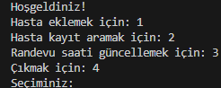

# Hastane Randevu Sistemi

C diliyle yazılmış terminal tabanlı hasta kayıt ve randevu yönetim sistemi.

## Özellikler
- Hasta ekleme (binary dosyaya kayıt)
- Hasta arama (hasta no ile)
- Randevu saati güncelleme

## Kullanılan Teknolojiler
- C (C99)
- Binary dosya I/O (.dat)
- Struct, fseek/fwrite ile doğrudan güncelleme

## Derleme ve Çalıştırma
```bash
gcc hasta_randevu.c -o hastane
./hastane
```

## Ekran Görüntüsü
